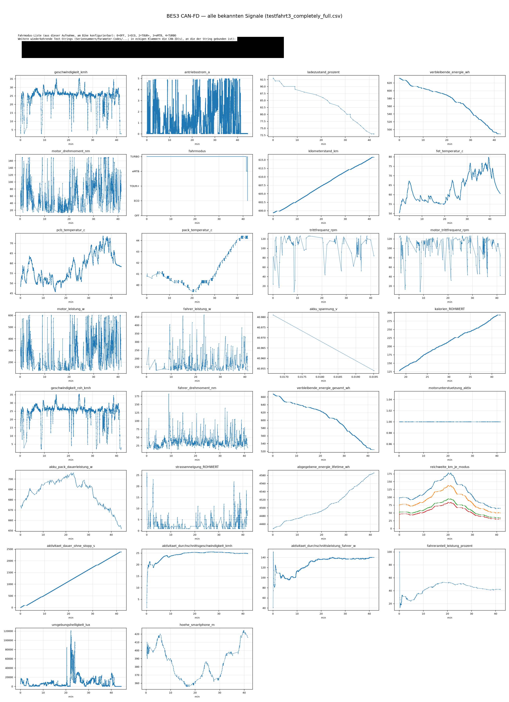

# bes3-analyzer

Read-only-Analyse des CAN-FD-Busses des Bosch-eBike-**Smart-Systems** (BES3-Generation).
Dieses Dokument beschreibt den Frame-Aufbau, die Dekodier-Methode und die bisher
bestätigten Signale.

Read-only-Interoperabilität/Diagnose. Kein Fälschen oder Manipulieren von Nachrichten.

Zum Aufzeichnen eigener CAN-FD-Mitschnitte siehe [`bes3-canfd-logger/`](bes3-canfd-logger/README.md),
zur Dekodier-Bibliothek (für Dateien und einzelne Live-Nachrichten) siehe
[`bes3-decoder/`](bes3-decoder/README.md), zum Visualisieren aufgezeichneter
Logs siehe [`bes3-log-plotter/`](bes3-log-plotter/README.md).

Neben CAN-FD kann [`bes3-decoder/`](bes3-decoder/README.md#ble-unterstützung)
mittlerweile auch **BLE-Nachrichten** desselben Smart-Systems dekodieren: die
BLE-2-Byte-ID entspricht den unteren 16 Bit der CAN-Entry-ID, beide nutzen
dasselbe Varint-Wire-Format — dieselbe `SIGNALS`-Tabelle gilt für beide Wege.
Das reine **Dekodieren** aufgezeichneter BLE-Logs (`bes3-decoder`,
`bes3-log-plotter`) funktioniert (siehe Screenshot unten). Zur BLE-Aufzeichnung
selbst und einer Live-Verbindung per PC siehe die
[Einschränkung weiter unten](#ble-aufzeichnunglive-verbindung-per-pc-nicht-möglich).

<table>
<tr>
<td width="50%"><a href="bes3-log-plotter/example-plots/testfahrt_lang.png"></a><br><sub>bes3-log-plotter — CAN-FD/BLE, nachträglich aus einer Aufnahme</sub></td>
</tr>
</table>

## Bus

- **CAN-FD**, nominale Bitrate **500 kBaud**, Daten-Bitrate **2000 kBaud**.
- Payloads bis zu **64 Byte**.

## Frame-Aufbau

Jeder Frame ist gleich strukturiert:

```
Byte  0 –  7 : MAC (Message Authentication Code) – ändert sich pro Frame
Byte  8 – 10 : Freshness-Counter (3 Byte, big-endian) – gegen Replay-Attacken
Byte 11      : (Teil des Headers / unbenutzt)
Byte 12 …    : Payload = Folge von Tag-Value-Einträgen
```

Da der MAC die ersten 8 Byte jedes Frames zufällig macht, **immer erst den
12-Byte-Header abschneiden**, dann die Payload parsen.

### Tag-Value-Einträge

```
4 Byte : Entry-ID (big-endian) = "Tag"
n Byte : ein Feld, Protobuf-Wire-Format
```

- Maßgeblich ist die **Entry-ID**, nicht die CAN-ID. Dieselbe Entry-ID kann unter
  verschiedenen CAN-IDs auftauchen; nach Entry-ID auflösen, nicht danach, in
  welcher Nachricht sie ankam.
- Das Feld nach dem Tag ist ein echter **Protobuf-kodierter Wert**, keine
  Ganzzahl fester Breite. Fast jeder Eintrag beginnt mit dem Byte `0x08` — das
  ist kein generischer „Marker", sondern das Protobuf-Tag-Byte für *Feld 1,
  Wire-Type 0 (Varint)* (`(1 << 3) | 0 = 8`). Danach folgt ein **Varint**:
  Basis 128, little-endian, 7 Nutzbits pro Byte, MSB bei jedem Byte außer dem
  letzten gesetzt.

  **Warum diese Kodierung:** Jeder Wert wird als winzige Ein-Feld-Protobuf-
  Nachricht (`{ value = <n> }`) verpackt statt in einem eigens für jedes Feld
  entworfenen, festen Byte-Layout. Das hat zwei Konsequenzen, die man beim
  Arbeiten mit diesem Bus kennen sollte:
  - **Ein generischer (De-)Serialisierer reicht für jedes Feld**, egal was es
    darstellt — das Wire-Format selbst trägt keine Einheit und keine Skala,
    nur eine nackte Ganzzahl. Prozent, °C, Nm, U/min, km/h sehen auf dem Draht
    alle identisch aus; der Skalierungsfaktor steckt komplett auf der
    Empfänger-/Anwendungsseite, nicht im Frame. Deshalb lassen sich
    Skalierungsfaktoren auch nicht aus dem Busverkehr allein ableiten —
    sie müssen pro Feld einzeln bestimmt werden (physikalische
    Plausibilitätsprüfung, Abgleich mit verwandten Signalen, bekannte
    Bauteil-Grenzwerte), statt sie aus einer festen Spezifikation abzulesen.
  - **Varints sind bandbreiteneffizient für den Normalfall:** Die meisten
    Telemetriewerte (Prozentzahlen, kleine Zählwerte, moderate physikalische
    Messwerte) passen so in 1–2 Byte statt in feste 4 oder 8 Byte — relevant,
    wenn viele Einträge in einen einzigen CAN-FD-Frame gepackt werden.

  Minimaler Varint-Decoder:
  ```python
  def read_varint(b, i=0):
      result = shift = 0
      while True:
          byte = b[i]; i += 1
          result |= (byte & 0x7F) << shift
          if not (byte & 0x80):
              return result, i
          shift += 7
  ```
  Zum Lesen eines Wertes: prüfen, dass `b[0] == 0x08`, dann `read_varint(b, 1)`.

- **Häufige Falle:** Das Feld als feste 2-Byte-Little-Endian-Zahl behandeln
  (also direkt `b[1:3]` lesen) statt den Varint zu dekodieren. Bei kleinen
  Werten (< 128) ergibt das zufällig dasselbe Ergebnis wie die korrekte
  Varint-Dekodierung, was den Fehler verschleiern kann — er zeigt sich erst,
  wenn ein Wert über 127 steigt. Immer als echten Varint dekodieren.

### Echte Signale von Rauschen unterscheiden

Beim Suchen nach Kandidaten-Feldern:

- **Zähler vs. Signale:** Viele Einträge enthalten monotone Frame-/Freshness-
  Zähler, die zufällig in einem plausibel wirkenden Zahlenbereich landen. Ein
  echter Sensorwert steigt **und** fällt über die Zeit; ein Wert, der über
  hunderte Samples nie sinkt, ist ein Zähler, kein Sensor.
- **Skalen-Plausibilitätsprüfung:** Ist ein Kandidaten-Rohwert dekodiert, gegen
  eine bekannte physikalische Grenze des Bauteils prüfen (z. B. begrenzen
  Zellenzahl und Chemie eines Akkus die mögliche Spannung, ein Motor-Datenblatt
  begrenzt Leistung/Drehmoment, ein Signal, das im Stand fehlt, ist
  bewegungsgetriggert). Ein Skalierungsfaktor, der physikalisch unmögliche
  Werte ergibt, ist falsch — auch wenn das rohe Byte-Layout richtig aussah.
- Eine Tag-Position `i` ist plausibel, wenn `payload[i] == 0x00` und
  `0 < payload[i+1] <= 0x80` (Beginn eines 4-Byte-Tags). In der Praxis ist die
  gezielte Suche nach einem bekannten Tag (`payload.find(tag)`) zuverlässiger
  als ein heuristisches Schiebefenster.

## Dekodierte Signale

Angegebene CAN-IDs sind, wo der Eintrag typischerweise beobachtet wird; nach
Entry-ID auflösen.

| Signal | CAN-ID | Entry-ID | Formel | Einheit |
|---|---|---|---|---|
| Geschwindigkeit (angezeigt) | `409` | `001C982D` | `varint / 100` | km/h |
| Antriebsstrom | `362` | `000061A8` | `roh(64-Bit BE) × 5,684341886e-14` (kein `0x08`-Marker — rohe Bytes) | A — Gesamtstrom der Antriebseinheit (Motor + Licht + Elektronik), nicht nur Motor |
| Ladezustand (SoC) | `502` | `00108088` | `varint` (keine Skalierung) | % |
| Verbleibende Energie (Fahrer) | `502` | `00148091` | `varint / 10` | Wh |
| Kilometerstand | `419` | `00189818` | `varint / 1000` | km (Rohwert ist Meter) |
| Fahrmodus | `419` | `00109809` | `varint` = Index in Modus-Liste | — siehe „Fahrmodi" |
| Motor-Drehmoment | `401` | `00149815` | `varint / 10` | Nm |
| Motor-Leistung | `409` | `0014985D` | `varint` (keine Skalierung) | W |
| Fahrer-Leistung | `409` | `0014985B` | `varint` (keine Skalierung) | W |
| Trittfrequenz (Fahrer) | `409` | `0010985A` | `varint` (keine Skalierung) | U/min |
| Trittfrequenz (Motor) | `401` | `0010985C` | `varint` (keine Skalierung) | U/min |
| Akku-Pack-Temperatur | `502` | `0014808B` | `varint / 10` | °C |
| Akku-FET-Temperatur | `502` | `001480D2` | `varint / 10` | °C |
| Antriebseinheit-PCB-Temperatur | `401` | `00149884` | `varint / 10` | °C |
| Akku-Spannung (live) | `502` | `0018808C` | `varint / 1000` | V |
| Geschwindigkeit (roh, unangezeigt) | `401` | `001C9808` | `varint / 100` | km/h — ungerundeter Rohwert, s. `DISPLAYED_BIKE_SPEED` |
| Fahrer-Drehmoment | `401` | `00149814` | `varint / 10` | Nm |
| Verbleibende Energie (gesamt) | `502` | `00148092` | `varint / 10` | Wh — ohne Fahrer-Normierung, s. „Verbleibende Energie (Fahrer)" |
| Motorunterstützung aktiv | `401` | `00109883` | `varint` (Bool) | — |
| Akku-Pack-Dauerleistung | `502` | `001480D5` | `varint` (keine Skalierung) | W |
| Straßenneigung (roh) | `408` | `0010981D` | `varint` (keine Skalierung) | vermutlich % — Einheit/Vorzeichen bei Gefälle nicht verifiziert |
| Abgegebene Energie (Lifetime) | `502` | `0014809C` | `varint` (keine Skalierung) | Wh — monotoner Lifetime-Zähler |
| Reichweite je Fahrmodus | `419` | `····9857` (oberes Wort variabel, s. u.) | gepacktes Protobuf-Array, 4 Werte | km, absteigend sortiert (Modus 1–4: ECO/TOUR+/eMTB/TURBO) |
| Aktivitätsdauer ohne Stopp | `3C8` | `····A243` (oberes Wort variabel) | `varint` (keine Skalierung) | s — seit Beginn der aktuellen Aktivität, ohne Stopp |
| Durchschnittsgeschwindigkeit (Aktivität) | `3C8` | `0014A246` | `varint / 100` | km/h |
| Durchschnittsleistung Fahrer (Aktivität) | `3C8` | `····A24A` (oberes Wort variabel) | `varint` (keine Skalierung) | W |
| Fahreranteil an Antriebsleistung | `3C8` | `0010A254` | `varint` (keine Skalierung) | % |
| Umgebungshelligkeit | `3C8` | `····A141` (oberes Wort variabel) | `varint / 1000` | Lux |
| Höhe (Smartphone) | `3C8` | `0014C085` | `varint` (keine Skalierung, signed) | m — **kein Bike-Sensor**, s. u. |

**Sonderfall Höhe (`0014C085`):** Liegt in derselben CAN-ID-Domäne (`3C8`) wie
mehrere andere Werte, die klar vom gekoppelten **Smartphone** stammen
(Durchschnittsgeschwindigkeit/-trittfrequenz/-herzfrequenz einer Aktivität) —
vermutlich also eine Handy-Höhenschätzung, kein Sensor der Antriebseinheit.
Die Dekodierung selbst ist sauber (`0x08`-Marker, signed Int16, keine
Skalierung), aber die beobachteten Werte einer Aufnahme (ca. 356–424 m)
wurden beim Abgleich mit der tatsächlichen Fahrtstrecke als **nicht
plausibel** eingeschätzt — ob das an einer falschen
Vorzeichen-/Skalen-Annahme liegt oder das Feld grundsätzlich nicht die reale
Höhe widerspiegelt (z. B. Standort-/Wetterdienst-Schätzung statt echtem
Barometer), ist ungeklärt. Mit Vorsicht behandeln.

**Sonderfall `REACHABLE_RANGE` (`····9857`):** Das ist kein einzelner Varint,
sondern ein **gepacktes Protobuf-Repeated-Feld**: `0x0a <Länge> <gepackte
Varints>` mit genau 4 Werten. Ungewöhnlich: das **obere** Tag-Wort ist hier
nicht konstant — es wechselt live zwischen `0020`/`0024`/`0028`, je nachdem
wie viele Byte die 4 gepackten Varints gerade brauchen (jeder Wert ≥ 128
kostet ein Byte mehr, +4 im Tag pro zusätzlichem Byte). Die Werte fallen im
Gleichschritt mit dem Ladezustand über eine Fahrt und sind absteigend
sortiert — passt zu „Reichweite in den 4 nicht-OFF-Fahrmodi", höchste
Reichweite (ECO) zuerst.

Beispiele für Feld-Layouts (Bytes nach dem 4-Byte-Tag):
```
001C982D (Speed) : 08 <varint speed>
00108088 (SoC)   : 08 <varint percent>
```

**Nicht auf diesem Bus beobachtet:** GPS/Standort, Höhe **als Sensor der
Antriebseinheit/des Bikes** (erschöpfend im relevanten Adressraum gesucht —
hier nicht exponiert; die einzige gefundene „Höhe" ist ein vom Smartphone
zurückgespiegelter Wert, s. „Höhe (Smartphone)" oben — dessen Plausibilität
selbst fraglich ist), ein direktes Licht-An/Aus-Statusbit,
Tour-/Tageskilometerzähler, Betriebsstundenzähler.

## Fahrmodi

Der Fahrmodus-Wert (`00109809`) ist eine **Positions-Index** in eine Modus-
Namensliste, die auf dem Bus steht (typischerweise CAN-ID `401`) und am Bike
**konfigurierbar** ist. Die Liste ist protobuf-artig — jeder Eintrag ist
`0a <Länge> <ASCII-Name>`, die Reihenfolge definiert den Index.

Standard-Reihenfolge (Performance Line CX):

| Index | Modus |
|---|---|
| 0 | OFF |
| 1 | ECO |
| 2 | TOUR+ |
| 3 | eMTB |
| 4 | TURBO |

Da die Liste konfigurierbar ist (Namen/Reihenfolge/Support-Level), den Index
immer gegen die Liste **aus derselben Aufnahme** auflösen, nicht hart verdrahten.

## Ladegerät-/Akku-Domäne (`6xx`)

Diese CAN-IDs tragen die **Ladegerät-↔-Akku**-Kommunikation und sind nur
während des Ladens vorhanden (Akku + Ladegerät verbunden). Sie sind
**nicht** während normaler Fahrt zu sehen.

Anders als die Antriebsstrang-Nachrichten haben diese Frames **keinen
MAC/Header** — die Werte werden **direkt** aus den rohen Frame-Bytes gelesen
(Byte 1 = erstes Datenbyte). Die genaue Bedeutung einiger Felder ist noch
vorläufig (unten markiert).

| CAN-ID | Inhalt |
|---|---|
| `611` | **Vom Akku gesendet** (nicht vom Ladegerät); rohe Byte-Offsets. Byte 3–4: Strom. Byte 5–6: interne Zellpack-Spannung (vor dem MOSFET, innerhalb des Packs), mV. Byte 7–8: Spannung an der Akku-Klemme/-Buchse (nach dem MOSFET), mV. Byte 9–10: vermutlich Temperatur (m°C — vorläufig). |
| `613` | Ladegerät-Seriennummer + EN-Nummer (ASCII). |
| `603` | Akku-Seriennummer (ASCII). |
| `600` / `601` / `602` | Einmalig beim Ladestart gesendet (z. B. zulässiger Strom). Die `600`-Antwort hängt vom Inhalt des `611`-Frames ab. |
| `748` | Viele DLC-8-Nullpakete — vermutlich Keep-alive vom Ladegerät. |

## Klartext-Kennungen

Manche Nachrichten enthalten statische, menschenlesbare ASCII-Zeichen
(identisch über Aufnahmen hinweg).

**Bauteil-Typcodes** (Bosch-Modellnummern, im Klartext):

| Code | Bauteil |
|---|---|
| `BDU3740` | Antriebseinheit/Motor (Performance Line CX) |
| `BBP3770` | Akku (Battery Pack) |
| `BCM3100` | ConnectModule |
| `BHU3600` | Bedien-/Steuereinheit (Display) |

**Konfigurations-/Parameter-Tabelle** — gefunden in **CAN-ID `401`** (auch in
`3C2` und `409` gesehen). Die Strings sind **protobuf-artig,
längenpräfixiert**: jeweils `0a <Länge> <ascii>` oder `1a <Länge> <ascii>`.
Beobachteter Inhalt:

- **Modus-Namensliste** (Entry-Tag `0080980c`): `0a <Länge> <Name>` je Modus →
  `OFF · ECO · TOUR+ · eMTB · TURBO` (siehe „Fahrmodi").
- **Region/Geschwindigkeitsbegrenzung** `25kmh_EU-AU-ZA`, kodiert als
  `1a 0e <14 Byte>`.
- **Parameter-Einträge**, die einen Bosch-Code mit einem Label paaren, z. B.
  `G100MDEMA0` ↔ `Derailleur`, `A100ECOP37` ↔ `ECO`, `P100M374X0` ↔ `Pedal…`
  (Label abgeschnitten), plus Codes wie `S100REA251`, `A100M0AUTO`,
  `A100MAAAA0`. Die **Bedeutung der meisten Parameter-Codes und ihrer
  numerischen Werte ist noch nicht entschlüsselt**; nur Region/Geschwindigkeit,
  die Modus-Liste und das Vorhandensein eines `Derailleur`-Eintrags
  (elektronische Schaltung) sind klar interpretierbar.

**Teile-/Materialnummern** erscheinen als ASCII im Bosch-Format
`DEB… * nnnnn-nnnn-nn-…`.

## BLE-Aufzeichnung/Live-Verbindung per PC nicht möglich

Es gab einen Versuch, BLE-Mitschnitte und eine Live-Verbindung auch direkt
vom PC aus (per Bluetooth-LE-Adapter, ohne CAN-FD-USB-Adapter) umzusetzen.
Das Bike lässt aber nur eine aktive BLE-Verbindung gleichzeitig zu, und
diese ist an das gekoppelte Smartphone mit der Bosch-eBike-Flow-App
gebunden — ein unabhängiger `bleak`-Client auf dem PC bekam auch nach
erfolgreicher Windows-Kopplung keine funktionierende Verbindung zustande.
Der Python-Ansatz für die BLE-Aufzeichnung/Live-Verbindung per PC ist damit
leider nicht funktionsfähig; BLE-Signale lassen sich aktuell nur über das
Android-Gerät sniffen, auf dem die Flow-App läuft. Als Beispiel (auch für
ein Web-Cockpit) bleiben Logger und Cockpit im Branch
[`feature/ble-decoder`](https://github.com/revlat/bes3-analyzer/tree/feature/ble-decoder)
erhalten.

<a href="example_cockpit.png"></a><br><sub>BLE-Cockpit (Beispiel, Branch <code>feature/ble-decoder</code>) — live im Browser</sub>

## Markenhinweis

Dies ist ein inoffizielles, unabhängiges Hobbyprojekt ohne Verbindung zu oder
Unterstützung durch Bosch. Genannte Marken- und Modellbezeichnungen (z. B.
Bosch-Bauteil-Typcodes) sind Eigentum der jeweiligen Rechteinhaber und werden
hier nur beschreibend zur Kompatibilitäts-/Interoperabilitätsangabe verwendet.

## Haftungsausschluss

Dieses Projekt dient ausschließlich der Read-only-Analyse/Diagnose des
CAN-Busses. Es wird ohne jegliche Gewähr für Richtigkeit oder Vollständigkeit
bereitgestellt; die Nutzung erfolgt auf eigenes Risiko.

## Lizenz

MIT — siehe [LICENSE](LICENSE).
