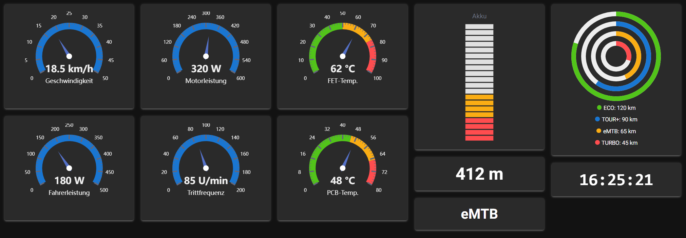

# bes3-ble-cockpit

Live-Dashboard (lokale Web-Oberfläche) für BLE-Notifications des
Bosch-eBike-Smart-Systems: konfigurierbare Gauges/LED-Balken/Zahlen/Badges,
die sich **sofort bei jeder eintreffenden Notification** aktualisieren —
kein Zeitintervall, kein Polling. Read-only — es werden keine Nachrichten
gesendet, keine Verbindung manipuliert.

<a href="example_cockpit.png"></a>

*(Screenshot im `--demo`-Modus mit Testwerten, siehe „Nutzung" unten — zeigt
die Starter-Config aus `config.yaml`.)*

Baut vollständig auf vorhandenen Bausteinen auf, keine eigene
Verbindungs-/Dekodierlogik:

- [`ble_connector.stream_ble_notifications()`](../bes3-ble-logger/README.md)
  für Scannen/Verbinden/Notify-Abo inkl. automatischem Reconnect bei
  Verbindungsabbruch.
- [`decode_bes3.decode_ble_frame()`](../bes3-decoder/README.md#ble-unterstützung)
  für die Dekodierung — dieselbe `SIGNALS`-Tabelle wie CAN-FD.

## ⚠ Bekannte Einschränkung: Live-Verbindung noch nicht zuverlässig

Beim ersten echten Test gegen ein reales Bike ließ sich bisher **keine**
stabile BLE-Verbindung herstellen, solange/nachdem das Bike bereits mit
einem anderen Gerät (Handy mit Bosch-eBike-Flow-App) gekoppelt war — das
Bike scheint absichtlich nur eine aktive Verbindung gleichzeitig zuzulassen
und setzt eine vorherige Kopplung (Pairing/Bonding) voraus. Selbst nach
erfolgreicher Windows-Kopplung konnte `bleak` das Gerät nicht zuverlässig
finden/verbinden (vermutlich rotierende private BLE-Adresse). Details und
mögliche Auswege siehe die „Bekannte Einschränkung" in der
[`bes3-ble-logger`-README](../bes3-ble-logger/README.md#bekannte-einschränkung-live-verbindung-noch-nicht-zuverlässig)
— gilt hier genauso, da dasselbe `ble_connector.py` genutzt wird.

Der `--demo`-Modus (siehe unten) funktioniert davon unabhängig einwandfrei,
da er ohne echte BLE-Verbindung auskommt.

## Voraussetzungen

```bash
pip install nicegui pyyaml bleak
```

(`bleak` wird bereits von `bes3-ble-logger` benötigt — siehe dort für
Details zu Plattform-Backends unter Windows/Linux/macOS und zur venv-Anleitung.)

## Nutzung

```bash
python3 bes3-ble-cockpit.py [--config config.yaml] [--port 8080] \
    [--scan-timeout 10] [--reconnect-delay 3] [--demo]
```

- `--config` (optional, Standard: `config.yaml` neben diesem Skript): Pfad
  zur Anzeige-Konfiguration, siehe unten.
- `--port` (optional, Standard `8080`): Port des lokalen Webservers. Danach
  im Browser `http://localhost:8080` öffnen (öffnet sich standardmäßig
  automatisch).
- `--scan-timeout` / `--reconnect-delay`: siehe
  [`bes3-ble-logger`](../bes3-ble-logger/README.md#nutzung) — identisches
  Verhalten (automatischer Reconnect bei Verbindungsabbruch, endlos, bis das
  Bike gefunden wird).
- `--demo` (optional): zeigt plausible Testwerte auf allen Kacheln an, **ohne**
  echte BLE-Verbindung — praktisch zum Anschauen von Layout/Farben ohne Bike
  in Reichweite (siehe `_DEMO_VALUES` im Skript, dort auch anpassbar). Der
  Screenshot oben ist im `--demo`-Modus entstanden.
- Beenden: `Strg+C` im Terminal.

Gedacht für **eine einzelne lokale Browser-Session** (ein Nutzer, ein Bike)
— kein Mehrbenutzer-/Mehr-Bike-Betrieb.

## Konfiguration (`config.yaml`)

### Globale Darstellung (`display`)

```yaml
display:
  background_color: "#121212"       # Seiten-Hintergrundfarbe
  tile_background_color: "#2a2a2a"  # Hintergrundfarbe der Kacheln
  text_color: "#f0f0f0"             # Textfarbe der Werte/Badges/Legenden
  scale: 1.0                        # Skalierung der gesamten Seite (1.0 = 100 %)
```

Alle vier Felder sind optional (weglassen = Browser-/NiceGUI-Standard).
`text_color` vererbt sich per CSS an alle Kind-Elemente ohne eigene
Farbangabe — betrifft also die großen Werte, Badges und die
Ring-Gauge-Legende, **nicht** die bewusst gedämpften kleinen
`text-gray-500`-Beschriftungen (die haben ihre eigene Tailwind-Farbklasse).
`scale` skaliert über die Root-Schriftgröße (nicht per CSS-`transform`) —
dadurch skalieren alle rem-basierten Größen (Kachelgrößen, Schrift,
Abstände) sauber mit, statt dass ein `transform` nachträglich
Layout/Overflow durcheinanderbringt. Praktisch z. B. `1.4`–`1.6` für ein
kleines/weit entferntes Display am Lenker, `0.7`–`0.8` für mehr Kacheln auf
einen Blick auf einem großen Monitor.

Ist `background_color` gesetzt, aktiviert das Skript zusätzlich automatisch
NiceGUIs `ui.dark_mode()`, damit Text-/Komponentenfarben stimmig mitwechseln
(sonst bliebe Text z. B. weiterhin dunkel und auf einem dunklen Hintergrund
unlesbar). Gedacht für ein **dunkles** Cockpit — eine explizit helle
`background_color` würde sich damit nicht stimmig verhalten.

### Kacheln (`gauges`)

Jeder Eintrag unter `gauges` beschreibt eine Anzeige-Kachel:

```yaml
gauges:
  - signal: geschwindigkeit_kmh   # Schluessel aus decode_bes3.SIGNALS
    label: "Geschwindigkeit"
    unit: "km/h"
    type: gauge                  # gauge | vu_meter | led_bar | ring_gauge |
                                  # number | badge | clock_text | clock_analog
    min: 0
    max: 50
    thresholds: [20, 50]         # optional: Farbzonen (gauge/vu_meter/led_bar)
```

- `signal` (Pflicht außer bei `clock_text`/`clock_analog`): Schlüssel aus
  `decode_bes3.SIGNALS` — siehe die
  [Haupt-README](../README.md#dekodierte-signale) für die vollständige
  Liste aller bekannten Signale.
- `type`:
  - `gauge` — Zeiger-Anzeige im Vollkreis-Stil, braucht `min`/`max`.
  - `vu_meter` — Zeiger-Anzeige im Stil einer analogen Aussteuerungsanzeige
    (flacherer Bogen statt Vollkreis-Optik), ebenfalls mit `min`/`max`.
  - `led_bar` — vertikaler LED-Balken/Peak-Meter (diskrete Segmente statt
    Nadel, leuchten von unten nach oben), braucht `min`/`max`, optional
    `segments` für die Segmentanzahl (Standard `20`). In der Starter-Config
    für den Akku genutzt.
  - `ring_gauge` — mehrere konzentrische Fortschrittsringe (wie
    Activity-Ringe). **Nur** für `reichweite_km_je_modus` gedacht, das
    einzige Signal, das einen 4er-Wert statt eines einzelnen Skalars liefert
    (Reichweite je Fahrmodus ECO/TOUR+/eMTB/TURBO) — ein Ring pro Modus,
    plus eine Text-Legende mit den konkreten km-Werten darunter (die reinen
    Ringe allein wären ohne Zahlen wenig aussagekräftig). `min`/`max`
    gelten als gemeinsame Skala für alle vier Ringe.
  - Gauge/VU-Meter/LED-Balken (`gauge`/`vu_meter`/`led_bar`) unterstützen
    optional `thresholds` (z. B. `[20, 50]`) für rot/gelb/grün-Farbzonen
    (absolute Werte, nicht Anteile) sowie optional `invert_colors: true`,
    um die Reihenfolge auf grün/gelb/rot umzudrehen — für Signale, bei
    denen ein **hoher** Wert schlecht ist (z. B. Temperaturen), statt ein
    niedriger (wie beim Akku). In der Starter-Config für `fet_temperatur_c`/
    `pcb_temperatur_c` genutzt.
  - `number` — große Zahl, z. B. für Werte ohne sinnvollen festen
    Wertebereich.
  - `badge` — Text, für kategoriale Werte. Für `fahrmodus` wird ohne
    weitere Angabe automatisch `decode_bes3._MODI_DEFAULT` (die
    Default-Namensliste OFF/ECO/TOUR+/eMTB/TURBO) verwendet — keine
    Duplizierung der Namensliste in der Config nötig.
  - `clock_text` — aktuelle Uhrzeit als Text (`HH:MM:SS`). Braucht kein
    `signal` — aktualisiert sich unabhängig vom Bike einmal pro Sekunde.
    Zeigt bewusst **kein** Titel-Label (eine Uhr erklärt sich selbst).
  - `clock_analog` — aktuelle Uhrzeit als analoge Uhr (Stunden-/Minuten-/
    Sekundenzeiger). Ebenfalls kein `signal` nötig, gleiche
    Sekunden-Aktualisierung, ebenfalls kein Titel-Label.
- `label` (optional): Anzeigename über der Kachel (bei `gauge`/`vu_meter`
  eingebettet in den Chart selbst). Ohne Angabe wird **kein** Titel gezeigt
  (kein automatischer Fallback auf den rohen Signalnamen) — bei
  `clock_text`/`clock_analog` ohnehin immer ignoriert.
- `unit` (optional): wird an den Wert angehängt.

Die mitgelieferte `config.yaml` ist eine sinnvolle Starter-Auswahl
(Geschwindigkeit, Fahrer-/Motorleistung, Trittfrequenz, FET-/PCB-Temperatur,
Akku als LED-Balken, Höhe, Fahrmodus, Reichweite je Modus als Ringe,
Uhrzeit als Text und als Uhr) — orientiert an den beobachteten Werten aus
echten Aufnahmen sowie den bekannten technischen Daten der Bosch
Performance Line CX (siehe Haupt-README, Bauteil-Typcode `BDU3740`). Gerne
an das eigene Bike/die eigene Fahrweise anpassen oder um weitere Signale
aus `SIGNALS` erweitern.

**Bekannte offene Frage bei der Trittfrequenz:** manche BLE-Auswertungen
berichten hier einen Faktor-2-Unterschied zur tatsächlichen Trittfrequenz
(siehe BLE-Abschnitt der [`bes3-decoder`-README](../bes3-decoder/README.md#ble-unterstützung))
— die Default-Range ist deshalb bewusst großzügig gewählt, bis das geklärt
ist.

## Aufbau

- `bes3-ble-cockpit.py` — die NiceGUI-App: baut beim Seitenaufruf die
  konfigurierten Kacheln (`Tile`-Klasse), startet beim Serverstart einen
  Hintergrund-Task (`ble_task`), der `stream_ble_notifications()` konsumiert
  und jede dekodierte Notification an die passende Kachel weiterreicht.
- `config.yaml` — Anzeige-Konfiguration, siehe oben.

**Layout**: CSS-Mehrspaltenlayout (`column-width`) statt einer einfachen
umbrechenden Zeile — dadurch fließt jede Kachel von oben nach unten in die
nächste freie Spalte statt stur nebeneinander zu wrappen. Kurze Kacheln
(z. B. Uhrzeit, Badges) und lange (z. B. der LED-Balken) packen sich so
selbstständig dichter, ohne dass unterhalb kurzer Kacheln Platz
verschenkt wird.

**"Keine Daten"-Overlay**: Kommt 10 Sekunden lang keine einzige Notification
mehr rein (unabhängig davon, ob sie zu einem bekannten Signal gehört), blendet
sich oben ein rotes Banner ein — "Keine Daten seit X Sekunden", mit
laufendem Sekunden-Zähler. Verschwindet automatisch, sobald wieder eine
Notification eintrifft. Nur im Normalbetrieb aktiv, nicht im `--demo`-Modus
(dort gibt es keinen echten BLE-Task, das Overlay würde sonst nach 10s
dauerhaft angezeigt).

Kein eigener State über einen Neustart hinaus — beim Beenden (`Strg+C`) wird
der Hintergrund-Task sauber abgebrochen (BLE-Verbindung wird ordentlich
getrennt, kein hängender Zustand).

## Als eigenständiges Cockpit am Lenker (Raspberry Pi)

Das hier ist kein reines "am Laptop mitlaufen lassen"-Tool — die Architektur
eignet sich auch für ein **dauerhaft am Bike montiertes Cockpit**:

- Ein **Raspberry Pi** (die meisten Modelle haben eingebautes Bluetooth LE)
  läuft `bes3-ble-cockpit.py` genau wie auf dem Laptop — `bleak` nutzt auf
  Linux denselben BlueZ-Backend, der schon bei
  [`bes3-ble-logger`](../bes3-ble-logger/README.md#womit-hardware--software)
  dokumentiert ist.
- Der Webserver bindet an alle Netzwerk-Interfaces, läuft also auf dem Pi
  selbst genauso wie hier gezeigt — kein zusätzlicher Code nötig.
- Ein am Pi angeschlossenes **kleines Display** (offizielles
  Touch-Display, HDMI-Klein-Display o. ä.) zeigt einen Browser im
  **Kiosk-Modus** (Vollbild, keine Adressleiste), der auf
  `http://localhost:8080` zeigt — mit `display.scale` (siehe oben) an die
  Displaygröße/den Betrachtungsabstand am Lenker angepasst.

Damit lässt sich dieses Projekt als Basis für ein eigenes, unabhängiges
Bike-Display nutzen, statt nur als Laptop-Diagnose-Tool.

**Ungetestet:** Dieser Weg ist architektonisch naheliegend und nutzt nur
bereits vorhandene, dokumentierte Bausteine (BlueZ-Backend, Webserver-Bind
an alle Interfaces) — tatsächlich auf echter Raspberry-Pi-Hardware
ausprobiert wurde es hier aber nicht. Typische Stolpersteine wären z. B.
Kiosk-Modus-Einrichtung des Browsers und Autostart beim Boot, beides nicht
Teil dieses Projekts.

## Grenzen

- Reine Anzeige — kein Aufzeichnen. Für eine Aufzeichnung stattdessen
  [`bes3-ble-logger`](../bes3-ble-logger/README.md) nutzen. Ob beide
  gleichzeitig mit dem Bike verbunden sein können, hängt davon ab, ob das
  Gerät mehr als eine aktive BLE-Verbindung zulässt (siehe „Voraussetzung"
  in der `bes3-ble-logger`-README zur Verbindungs-Exklusivität) — ungetestet,
  im Zweifel nacheinander statt gleichzeitig nutzen.
- Read-only: es werden ausschließlich Notifications empfangen, nie
  geschrieben — kein Steuern/Manipulieren des Bikes.

## Lizenz

MIT — siehe [LICENSE](../LICENSE) im übergeordneten Ordner.
