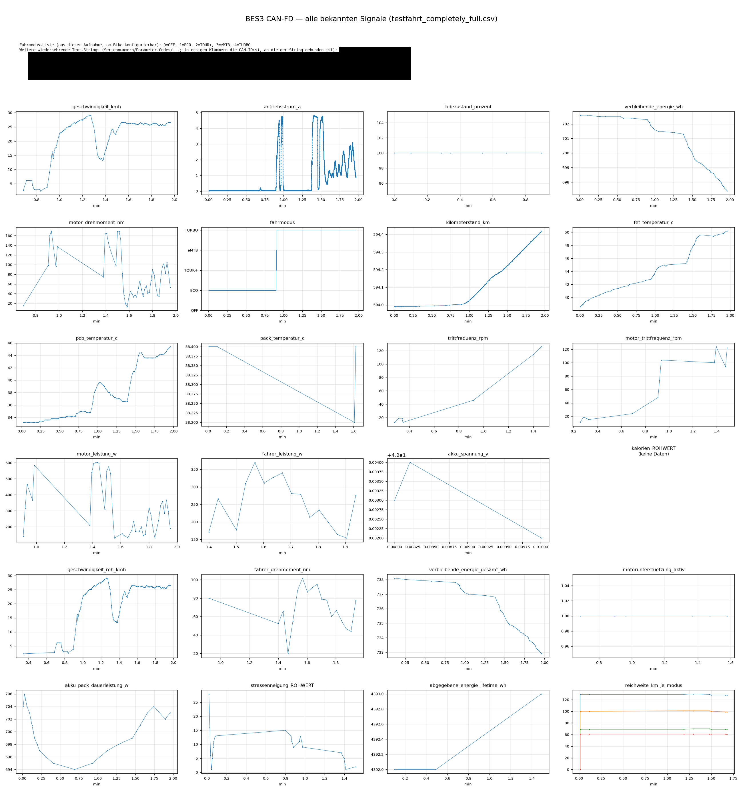
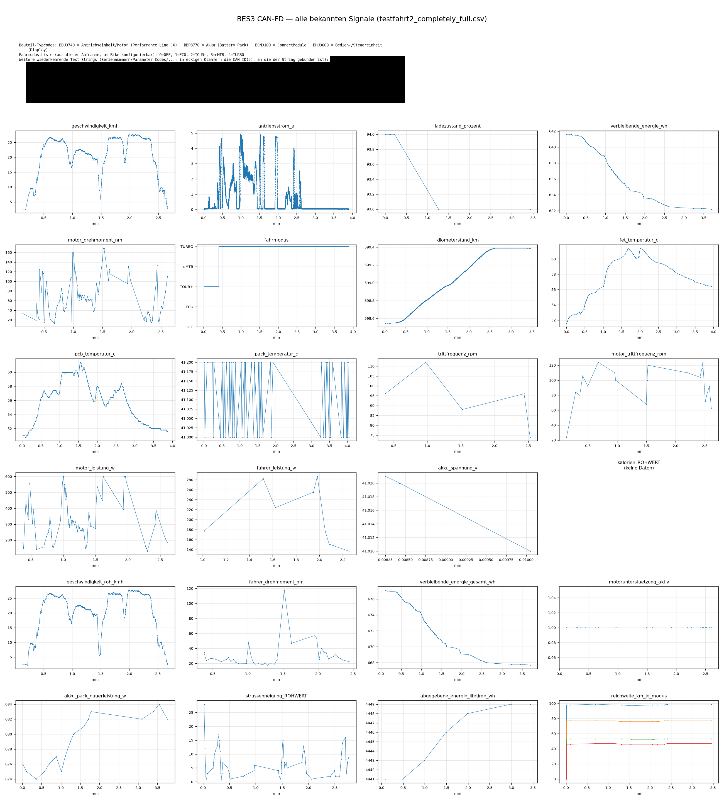

# bes3-log-plotter

Plottet **alle aktuell bekannten** BES3-Signale (Geschwindigkeit, SoC,
Drehmoment, Temperaturen, Fahrmodus, …) aus einer mit [`bes3-logger`](../bes3-logger/)
aufgezeichneten CSV als ein gemeinsames Bild mit einem Subplot pro Signal —
plus ein Text-Panel mit den in der Aufnahme gefundenen **Klartext-ASCII-
Strings** (erkannte Bauteil-Typcodes, die tatsächlich am Bike konfigurierte
Fahrmodus-Liste, sowie weitere wiederkehrende Strings wie Seriennummern und
Parameter-Codes).

Stand: 2026-07-21 — der Stand der **bekannten** Signale, siehe „Aktualität"
unten. Zum Frame-Aufbau, zur Varint-Dekodierung und zur vollständigen,
maßgeblichen Signal-/Skalierungstabelle siehe die
[Haupt-README](../README.md).

## Beispiel-Plots

Klick auf ein Bild für die volle Auflösung.

<table>
<tr>
<td width="33%"><a href="example-plots/testfahrt_kurz_1.png"></a><br><sub>testfahrt (kurze Aufnahme)</sub></td>
<td width="33%"><a href="example-plots/testfahrt_kurz_2.png"></a><br><sub>testfahrt2 (kurze Aufnahme)</sub></td>
<td width="33%"><a href="example-plots/testfahrt_lang.png"></a><br><sub>testfahrt3 (lange Aufnahme)</sub></td>
</tr>
</table>

## Wozu

Zwei Zwecke:

1. **Visualisierung** eigener Log-Aufzeichnungen — ein Blick über die ganze
   Fahrt statt Rohzahlen in einer CSV.
2. **Proof/Sanity-Check** der bisher gefundenen Signale und Skalierungsfaktoren:
   Wer die Herleitung in der Haupt-README nachvollziehen will, sieht hier die
   dekodierten Werte tatsächlich geplottet und kann sie gegen die eigene
   Fahrt plausibilisieren (z. B. Geschwindigkeit vs. gefahrene Strecke,
   Temperaturverlauf unter Last). Dasselbe gilt fürs Text-Panel: die
   erkannten Bauteil-Typcodes und die tatsächliche Fahrmodus-Liste lassen
   sich direkt gegen die „Klartext-Kennungen"/„Fahrmodi"-Abschnitte der
   Haupt-README abgleichen.

Der Code dient außerdem als **Beispiel, wie man die Rohdaten verarbeitet**:
CSV einlesen → Frames anhand der Entry-ID dekodieren (Varint-Wire-Format) →
als Zeitreihe plotten. Wer eigene Auswertungen bauen will, kann hier
ansetzen. Die eigentliche Dekodier-Logik liegt dafür nicht mehr in diesem
Ordner, sondern zentral in [`bes3-decoder/`](../bes3-decoder/README.md)
(`decode_bes3.py`) — dort auch dokumentiert, wie sich derselbe Dekoder
alternativ für **einzelne Live-CAN-Nachrichten** statt ganzer Dateien nutzen
lässt. `bes3-log-plotter.py` importiert `decode_bes3` von dort
(`../bes3-decoder/decode_bes3.py`) und läuft daher nur innerhalb des
geklonten Repos, nicht als isolierte Einzeldatei.

## Aktualität

Dieser Plotter zeigt **den heutigen Stand der bekannten Signale**
(`SIGNALS` in [`bes3-decoder/decode_bes3.py`](../bes3-decoder/decode_bes3.py))
— nicht mehr und nicht weniger. Sobald in der Haupt-README neue Signale
verifiziert werden, wird `bes3-decoder` **eventuell** nachgezogen (nicht
garantiert — bei Bedarf einfach `SIGNALS` dort an die Haupt-README anpassen,
das Mapping ist bewusst simpel gehalten). Unbekannte/noch nicht dekodierte
Werte (z. B. Höhe) tauchen hier
schlicht nicht auf.

## Ausblick: Live-Dekoder

Dieser Plotter arbeitet **nachträglich** auf einer fertigen Log-Datei. Der
zugrundeliegende Dekoder (`decode_frame()` in
[`bes3-decoder/`](../bes3-decoder/README.md)) kann Nachricht für Nachricht
auch **live** direkt auf dem laufenden CAN-FD-Bus dekodieren — dort auch ein
Minimalbeispiel dazu. Ein ausgebauter **Live-Dekoder mit richtiger
Anzeige/Dashboard** statt Roh-Konsolenausgabe ist als mögliches künftiges
Projekt angedacht (noch **nicht sicher, ob und wann**). Bis dahin ist dieser
Plotter der Weg, aufgezeichnete Fahrten im Nachhinein auszuwerten.

## Voraussetzungen

Python 3 mit [`matplotlib`](https://matplotlib.org/). `matplotlib` lässt
sich unter vielen aktuellen Linux-Distros **nicht** systemweit per
`pip install` installieren (PEP 668 „externally-managed-environment") —
ein virtuelles Environment ist daher der zuverlässige Weg:

**Linux/macOS:**
```bash
python3 -m venv .venv
.venv/bin/pip install matplotlib
.venv/bin/python bes3-log-plotter.py <log>_completely_full.csv
```

**Windows (PowerShell):**
```powershell
python -m venv .venv
.venv\Scripts\pip install matplotlib
.venv\Scripts\python bes3-log-plotter.py <log>_completely_full.csv
```

Wo `matplotlib` bereits systemweit verfügbar ist, geht auch einfach
`python3 bes3-log-plotter.py ...` ohne venv.

## Nutzung

```bash
python3 bes3-log-plotter.py <log_completely_full.csv> [-o ausgabe.png] [--dpi 130]
```

- `csv_path` (Pflicht): das Log, z. B. eine mit `bes3-logger` aufgezeichnete
  `*_completely_full.csv`.
- `-o` / `--output` (optional): Pfad der Ausgabe-PNG. Standard: derselbe Name
  wie die Eingabedatei mit Endung `_signals.png` statt `.csv`.
- `--dpi` (optional, Standard `130`): Auflösung der PNG.

Beispiel:
```bash
.venv/bin/python bes3-log-plotter.py testfahrt3_completely_full.csv
# -> gespeichert: testfahrt3_signals.png
```

Auch ohne eigene Aufnahme direkt nutzbar für die Entwicklung/zum Ausprobieren:
das Skript funktioniert mit jeder CSV im Format `Timestamp,ID,DLC,Data`, wie
sie `bes3-logger` schreibt (auch die reduzierten `_reduced_*`-Varianten
älterer Logger-Versionen, sofern noch vorhanden — enthalten aber ggf. Lücken).

## Ausgabe

Ein PNG mit:

- **Text-Panel** oben: erkannte Bauteil-Typcodes (falls in der Aufnahme
  vorhanden), die in **dieser** Aufnahme konfigurierte Fahrmodus-Liste, und
  weitere wiederkehrende ASCII-Strings (Seriennummern, Parameter-Codes,
  Region/Speed-Limit, Teilenummern, …) mit Fundhäufigkeit **und** den
  CAN-ID(s), an die der jeweilige String gebunden ist (in eckigen Klammern,
  z. B. `[401,4C2]` oder mit Domänen-Hinweis `[401 [Konfig-/Parameter-
  Tabelle]]`). Ein String taucht i. d. R. immer an einem festen, stabilen
  CAN-ID-Set auf — das grenzt ohne weitere Dekodierung ein, um was für eine
  Art Wert es sich vermutlich handelt (z. B. verschiedene Firmware-Versionen
  oder Teilenummern verschiedener Komponenten unterscheiden sich genau
  dadurch). Siehe `decode_bes3.extract_ascii_strings()`/`describe_can_ids()`
  in [`bes3-decoder`](../bes3-decoder/README.md) für Details. Nur Strings,
  die in mehreren Frames auftauchen, werden gezeigt, damit Zufallstreffer im
  MAC-Rauschen (die ersten 8 Byte jedes Antriebsstrang-Frames) nicht mit
  reinrutschen.
- **Ein Subplot je bekanntem Signal** darunter (x-Achse: Minuten seit
  Aufnahmebeginn). Der Fahrmodus wird kategorial geplottet (Stufenlinie mit
  den tatsächlichen Modus-Namen aus der Aufnahme selbst, nicht hart codiert
  — siehe „Fahrmodi" in der Haupt-README). Signale ohne Treffer in der
  jeweiligen Datei werden als leerer Subplot mit „(keine Daten)" markiert
  statt das Skript abzubrechen.

## Lizenz

MIT — siehe [LICENSE](../LICENSE) im übergeordneten Ordner.
